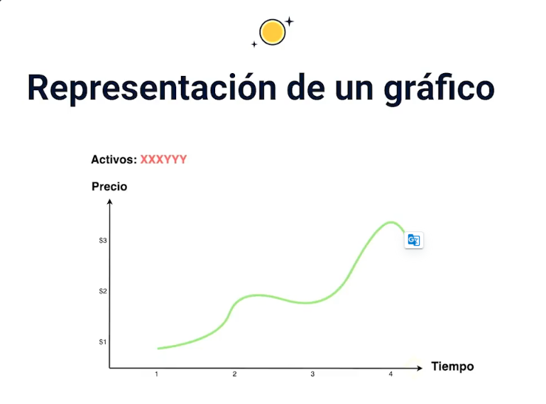
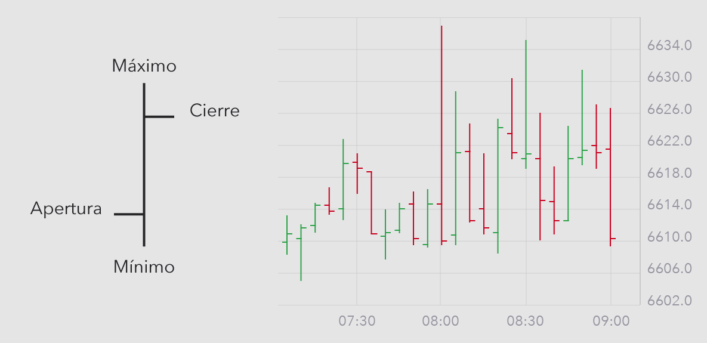
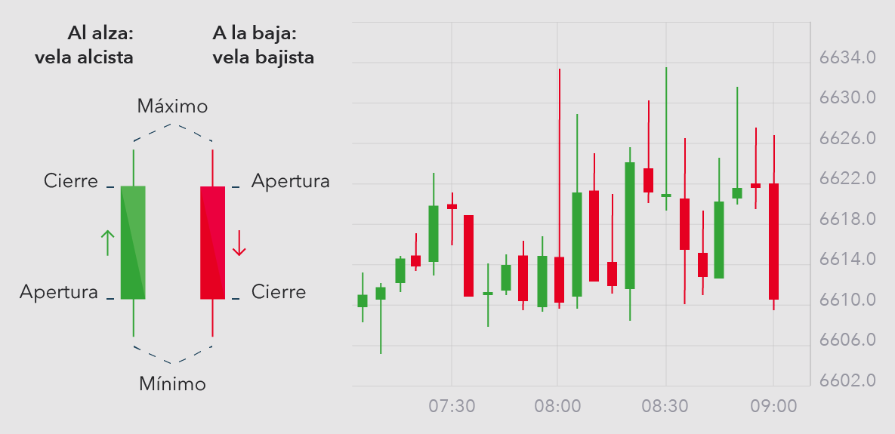
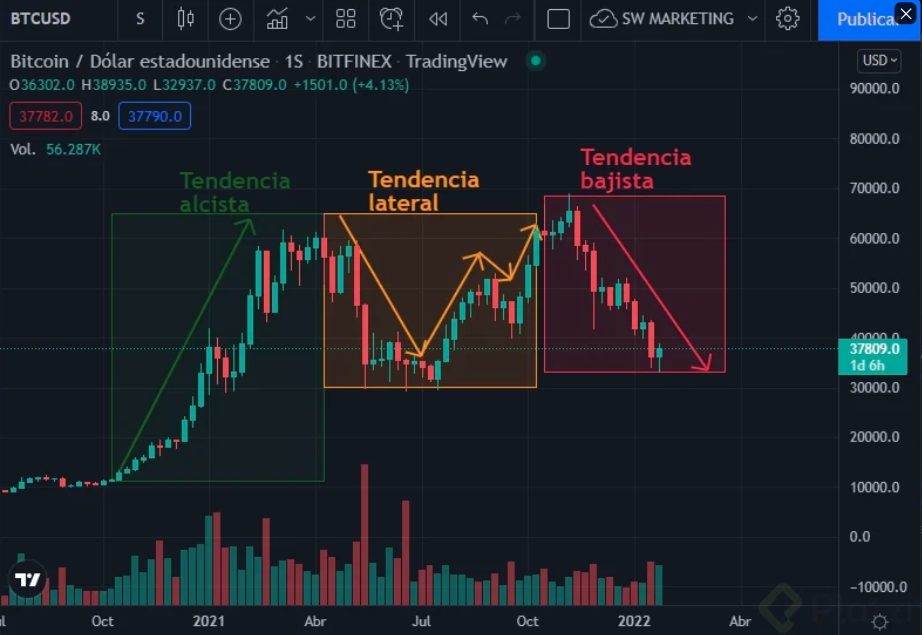
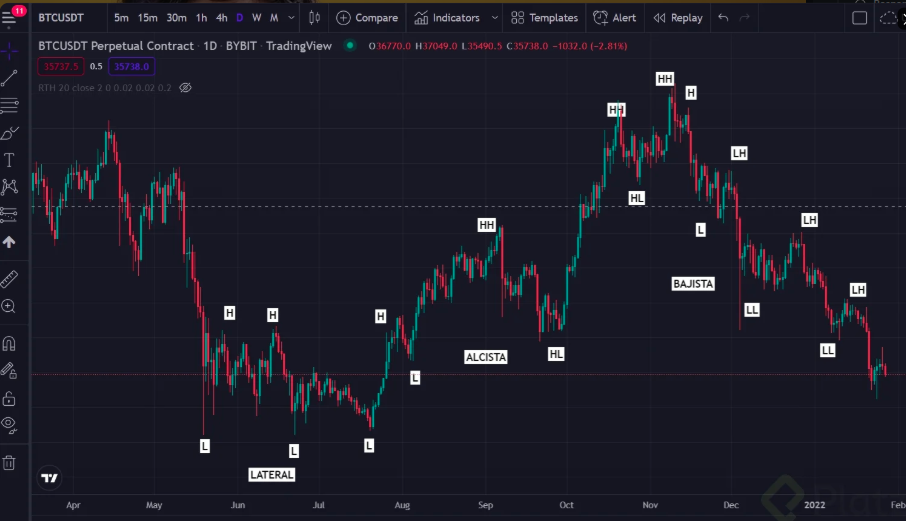

# Trading
### Tipos de Trading
- *Trading Discrecional:* Todas las decisiones son tomadas por nosotros mismos, basadas en proyecciones realizadas como indicadores, acción de precios, etc.
- *Trading Algorítmico:* Loa análisis son realizados por algoritmos o computadores.

## Análisis Técnico de Mercados Financieros

Un mercado financiero es un espacio físico o virtual en el que compradores y vendedores intercambian activos con agentes económicos de por medio. Este sistema facilita la interacción entre aquellas personas o entidades que cuentan con capital para invertir y las que necesitan ese capital.

### Tipos de mercados Financieros
- *Mercados monetarios:* Donde se ejecutan transacciones interbancarias y se maneja nuestra moneda.
- *Mercados de capitales:* Se refiere a los mercados de renta fija o renta variable.
- *Mercados de acciones:* En este mercado se realiza la compra/venta de títulos de propiedad de compañías públicas, por ejemplo: Apple, Tesla, Google, Meta, etc.
- *Mercados de futuros:* Es un acuerdo entre dos inversionistas en el que se comprometen a comprar y vender un activo, acordando en el momento en que se realice el intercambio las condiciones de dicha compraventa en el futuro.
- *Mercados de forex:* Mercados de intercambio de divisas, por ejemplo: dólar-euro, euro-libra esterlina, etc.
- *Mercados de criptodivisas:* En este mercado se realiza la compra y venta de criptoactivos, el más conocido es Bitcoin; sin embargo, existen miles de proyectos con Ether, BNB, Solana, USD Coin, etc.

### Qué es un activo financiero
Un activo financiero es un instrumento que tiene valor o puede generar ingresos. Este documento o título de propiedad puede ser emitido por un banco, empresa, institución privada o pública y se espera que le genere rendimientos a quien lo adquirió.

### Qué es un CFD
De sus siglas en inglés, un Contract For Difference es un contrato que se basa en el cambio del valor de los activos financieros mediante el cual el comprador paga al vendedor para adquirir un activo adyacente que cambiará de valor en el tiempo.
- Si la diferencia es positiva, el vendedor paga la diferencia al comprador.
- Si la diferencia es negativa, el comprador es quien debe pagar la diferencia al vendedor.

### Tipos de Análisis
- *Análisis Técnico:* El análisis técnico estudia los movimientos del mercado a través de los gráficos e indicadores basados en cálculos estadísticos.
- *Análisis Fundamental:* Nos ayuda a conocer el valor intrínseco de un activo, es decir, el valor al que debería cotizar, de este modo podemos conocer si este activo, está sub valuado o sobre valuado y así tomar decisiones de inversión acertadas.
- *Análisis Macroeconómico:* Evalúa la situación financiera de un país y cómo esto podría influir en la oferta y demanda.
- *Análisis Cuantitativo:* Es procesado por algoritmos, el cual funciona con base en comportamientos pasados del mercado y se toman decisiones automatizadas a partir de lo que ha sucedido anteriormente.

## Análisis Técnico
### Filosofía del Análisis Técnico
- Los movimientos del precio lo cuentan todo.
- Los precios se mueven por tendencias.
- La historia se repite.

### Tipo de Analistas
- Intradia
  - Temporalidades: 1m, 5m, 15m, 1h
  - Tiempo de las operaciones: Entre la apertura y cierre de las sesiones (Londres, NY, Asia)
- Swing
  - Temporalideades: 4h, D (Daily), W (Weekly)
  - Tiempo de las operaciones: Días o semanas
- Position
  - Temporalidades: D, W, M (Monthly)
  - Semanas o meses

### Broker o plataformas de intercambio
Programa informático que permite realizar operaciones con instrumentos financieros en tiempo real. Estas entidades ejecutan las órdenes del mercado bursátil y el trader es quien opera la plataforma.
Un broker es una entidad o empresa financiera que ejecuta órdenes de compra, venta y cobra comisiones por este servicio y cuenta con licencia para la compra y venta de acciones en los mercados bursátiles.Los traders necesitan de ellos para operar en estos mercados.
#### Cómo elegir un broker?
- Dependiendo del mercado (acciones, CFDs, ETF, Forex, cripto, etc.)
- Regulación y fiabilidad del broker
- Métodos de déposito y retiro
- Depósitos mínimos, lotaje y apalancamiento
- Instrumento de inversión disponibles y herramientas
- Tipos de ejecución de brokers (Market Maker o ECN)
- Spreads y comisiones
- Atención al cliente, formación, cuentas de prueba
- Disponibilidad en tu país
- Investiga antes de elegir un broker

### Tipos de cuentas
- Paper trading o cuentas demo
- Cuentas reales

### Acción de precio
Es como de forma gráfica se puede evaluar el precio para tomar decisiones, basado en la *Oferta* y la *Demanda*.
- *Oferta:* Vendedores → Intención de que el precio del activo baje → Osos → Gráfico bajista.
- *Demanda:* Compradores → Intención de que el precio del activo suba → Toros → Gráfico alcista.

### Tipos de gráficos
El primer eje (x) representa el tiempo y el segundo eje (y) representa el precio del activo. Es decir, la oferta y la demanda. Nos estamos enfrentando a pares de trading en la representación gráfica. ¿Eso qué significa? Básicamente, el cúmulo de 2 activos que normalmente se representa con tres letras.
- Bitcoin → BTC
- Dólar estadounidense → USD

- #### Gráfico de línea
Este tipo de gráfico solo tiene en cuenta el precio de cierre de un activo (precio de cierre, es decir, el precio final después del cambio al final del día). No toma en cuenta los precios de apertura o espacios que otros gráficos sí.

- #### Gráfico de barras
Los gráficos de barras tienen en cuenta el precio de cierre y el precio de apertura, el precio máximo y precio mínimo en la temporalidad elegida.

- #### Gráfico de velas japonesas
En los gráficos de velas japonesas tenemos un cuerpo que representa un color:
  - Rojo: la venta o intención de oferta.
  - Verde: demanda, intención de compra.

    
Función de los gráficos de velas japonesas:
- Evaluar el interés del precio de un activo en el mercado.
- Obtener información del precio y patrones que, encontrados en zonas particulares, pueden ayudarnos a tomar decisiones más efectivas en el tiempo.
- Generan una lectura fácil por su uso de colores.
- Son las que nos muestran el precio de apertura, cierre, el alto y el mínimo de la temporalidad elegida.

### Tendencias de mercado
El precio se mueve por tendencias, lsa cuales están formadas por una sucesión de máximos y mínimos. Son la dirección que siguen los precios del mercado, es decir hacia donde se están moviendo los precios.
- *Tendencias sostenidas en el tiempo:* Pendiente en torno a los 45°.
- *Tendencias fuertes:* Pendiente casi vertical y que normalmente muestran una menor duración en el tiempo.
Se utilizan líneas de tendencia para medir fortaleza.

#### Tipos de tendencia
- Alcistas
- Bajistas
- Laterales

